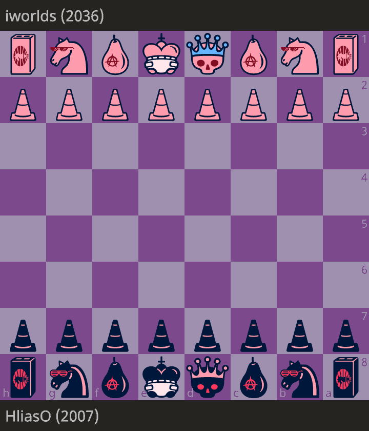
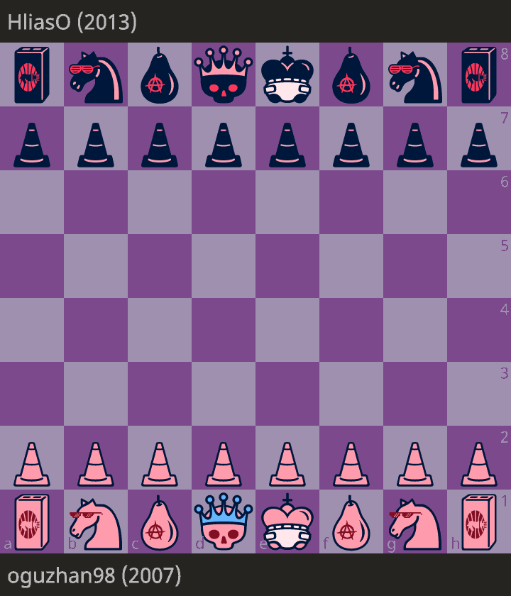

# Ai-Guess-the-Elo

An attempt at creating a neural network to guess a player's ELO rating based on their chess games/moves.

I had this idea in mind before chess.com released their version of an elo guessing ai but I postponed it long enough that they beat me to it. I was inspired by [Gothamchess' Guess the Elo series](https://www.youtube.com/watch?v=0baCL9wwJTA&list=PLBRObSmbZluRiGDWMKtOTJiLy3q0zIfd7).

All the effort on the project is condensed into a single file. You can run the `guess_the_elo.py` file with a pgn file as an argument. It will analyze the game, load the ai model and make a rating prediction for white and for black. For more info check [Usage instructions](#usage).

## The Backbone

The project uses LSTM models from the [PyTorch](https://pytorch.org) library to make the elo predictions. The models are fed games analyzed by stockfish and the [python-chess](https://python-chess.readthedocs.io/en/latest/#) library.

LSTM models were used, firstly as a learning experience, and secondly because their "memory" feature I thought closely resembles how a human would analyze a game. For more explanations behind the decisions made read the [Decisions Explained](/elo_ai/models/Decisions_Explained.md) file.

For the training data, games from all elo ranges from the [open lichess database June 2018](https://database.lichess.org/) were used after they were analyzed and modified accordingly. To speed up the process of uniformly selecting games of all elo ranges I used [pgn-extract](https://www.cs.kent.ac.uk/people/staff/djb/pgn-extract/).

## Results

The model trained, as explained in the [Decisions Explained](/elo_ai/models/Decisions_Explained.md) file predicts the probability of player's elo falling in some rating range. From 0 to 4000 with a 100 elo step, 39 total ranges.

To find the true elo of the player, the model takes the mean of the distribution with those probabilities per range.

### Training

The model was trained on 20000 games played on lichess.org in June 2018 chosen uniformly over all ratings. From those, 15% was used for testing and from the remaining 85%, 10% was used for validation. It was trained for 20 epochs, enough to decrease the loss while also avoiding overfitting.

For the model Kullback-Leibler Divergence loss was used for training. KLDiv loss is used to find the divergence between two distribution. In this case, between the elo distribution of the player and the predicted distribution of the model.

<p align="center">
  
</p>

We can clearly see a downwards trend that plateaus. We have reached a stagnation in training while avoiding overfitting.

### Predictions

To rate the accuracy of the model it is tested on 3000 games (= 6000 predictions, 2 per game for white and black)

Plotting the real values with the predictions we can visualize the accuracy of the model.

<p align="center">
  
</p>

On this graph we can see 2000 of the 6000 predictions made.  The closer to the red line (perfect matching) a dot is, the better the prediction.
Between the green lines is 50% of the data.  Additionally, 90% of the predictions are between the two purple lines, 500 points difference. This makes sense considering a bad game by a 1700 player could resemble a game of a 1200 player. Conversely, a good game by a 1200 could be mistaken for a 1700.

The points follow the lines pretty closely meaning the model has understood the differences between a good and a not so good player and can make predictions accordingly. It's clear though that the model has some troubles predicting low elo games and very high elo games. For games <1000 elo, the model tends to overestimate the player and for games >2600 it tends to underestimate them. The tradeoff is a good modeling of the middle of the rating ladder.

Keeping in mind that a player's strength was modeled as a normal distribution, according to the 68-95-99 rule, we should expect 68% of the predictions to fall within one standard deviation from the mean, 95% within two and 99% within three. In reality, the model's predictions fall 67% of the time within one standard deviation (280 points) from the true elo of the player, 94% within two and 98.7% within three. That means the model is very close to the expected accuracy.

These results can be found in the  [jupyter notebook](/elo_ai/models/rating_ranges/lstm_train_rating_ranges.ipynb).

## Usage

To get elo predictions for your chess games clone this repository and install the required libraries

```shell
git clone https://github.com/HliasOuzounis/Ai-Guess-the-elo
pip install -r requirements.txt
```

or download the files from the release page (outdated: old models, less accurate),

and run the `guess_the_elo.py` file with python

```shell
python guess_the_elo.py [--engine engine-dir] [-c] [-v] pgn_file
```

Because the games need to be analyzed by an engine first, you need to have a chess engine installed, preferably [stockfish](https://stockfishchess.org/download/). Pass the path as the --engine argument when calling the file. On linux you can find the installed path of stockfish with `which stockfish`. On my arch-based distro that was `/usr/bin/stockfish` which I have used as the default.

Because the training dataset was from lichess.org, the model has learned to predict lichess ratings. If your game is from chess.com pass the -c flag so the elo gets converted. On average chess.com ratings are 400 points lower than lichess.org.

If you want to visualize the predictions and see the probability distributions it predicts at each move, pass the -v flag. It will display the predictions at each move in a new window where you can navigate with the arrow keys. The predictions displayed will be in the lichess version. Press "ESC" or "q" to exit.

Finally, pass the pgn file which contains the game as the last argument. It needs to be parsable by chess.pgn.read_game(). If you copy the pgn from the website's "share" feature onto a plain text file it should be good enough.

### Examples

Feeding the models [one of my games](https://lichess.org/bNLqqjHP/black#0)

```shell
python guess_the_elo.py my_game.pgn
```

<p align="center">
  
</p>
I get predictions:

- 1800 for white
- 1900 for black

Considering I'm around 2000 rated on Lichess, those predictions are good.

For [other games](https://lichess.org/BoxuoUjy/black#0) the predictions aren't as accurate.

<p align="center">
  
</p>

The model predicts:

- 1600 for white
- 1650 for black

That's not very close to both of our ratings, it's within 2 standard deviations. It's possible though that we didn't play that well and the ratings it predicts are justified. It's hard to judge without an experienced player analyzing the games as well.

### Additional Notes

We should keep in mind that guessing a player's rating off of a single game is not a very good metric since players can have good or bad games.

Additionally, a player can't show his full level if their opponent plays badly and hands him the win. That means a player's elo prediction is indirectly affected by his opponent. (though the models judge a player solely on his moves, the positions that arise, which are determined by both players, are also taken into account)

Also, those ratings depend a lot on the stockfish evaluation of each game which isn't totally consistent even when analyzing the same game.

## Conclusions

Wow, chess is a very complex game, who would have thought!

It seems the model was able to understand what it means to play at a higher level, but the training dataset was small considering the amount of chess games possible and the model not deep enough to perfectly grasp the level of a player based on their moves especially at the edges of the rating ladder. It's also true that a players strength is difficult to measure based on just one game as the level of play has a lot of variance. Despite that, the accuracy that was achieved was satisfactory.

But it's safe to say that an experienced chess player/coach would probably make more accurate predictions than this model. Still, it was a fun project and a learning experience.
