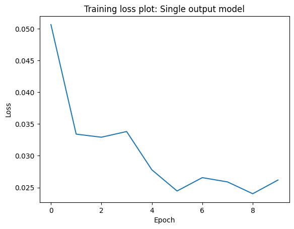
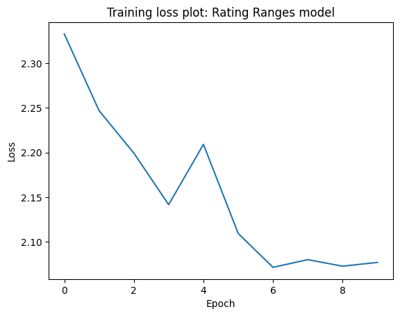
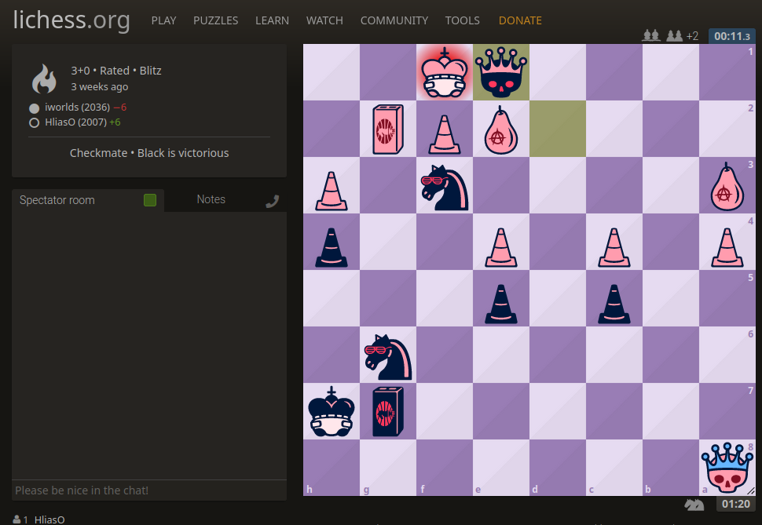
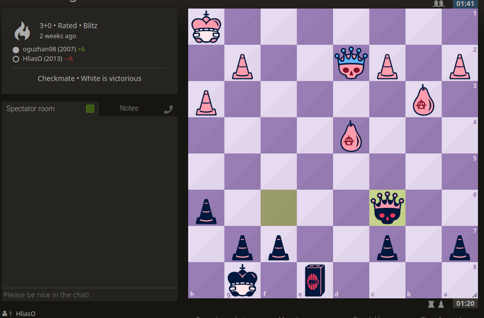

# ELO-Guesser
An attempt at creating a neural network to guess a player's ELO based on their chess games/moves.

I had this idea in mind before chess.com released their version of an elo guessing ai but I postponed it long enough that they beat me to it. I was inpired by [Gothamchess' Guess the Elo series](https://www.youtube.com/watch?v=0baCL9wwJTA&list=PLBRObSmbZluRiGDWMKtOTJiLy3q0zIfd7).

All the effort on the project is condensed into a single file. You can run the `guess_the_elo` file with a pgn file as an argument. It will analyze the game, load the ai models and make a rating prediction for white and for black. For more info check [Usage instructions](#Usage).

## The Backbone
The project uses LSTM models from the [PyTorch](https://pytorch.org) libray to make the elo predictions. The models are fed games analyzed by stockfish and the [python-chess](https://python-chess.readthedocs.io/en/latest/#) library.

LSTM models were used, firstly as a learning experience, and secondly because their "memory" feature I thought closely resembles how a human would analyze a game. For more explanations behind the decisions made read the [Decisions Explained](models/Decisions_explained.md) file. 

For the training data, games from all elo ranges from the [open liches database June 2018](https://database.lichess.org/) were used after they were analyzed and modified accordingly. To speed up the proccess of uniformly selecting games of all elo ranges I used [pgn-extract](https://www.cs.kent.ac.uk/people/staff/djb/pgn-extract/).

## Results
The two models trained, as explained in the [Decisions Explained](models/Decisions_explained.md) file, were the single output elo prediction and the rating ranges precition. To summarize, the single output model predictis an elo rating while the rating ranges model predicts the propability of the elo being in one of 10 rating ranges. Then the weighted average of those propabilities is taken for the elo prediction.  
### Training
Both models were trained on 2000 games played on lichess.org in June 2018, 200 games of each elo range were selected. From those, 15% was used for testing and from the remaining 85%, 10% was used for validation. They were trained for 10 epochs, enough to decrease the loss while also avoiding overfitting.
#### Single Output model
For the single output model Mean Squared Error was used as the loss function.

<p align="center">
  
</p>

#### Rating Ranges model
For the rating ranges model Cross Validation was used as the loss function. The problem is not exactly a classification problem because the weighted averages are used in the end for the elo prediction but it was the best I could find.


<p align="center">
  
</p>


It is important to note that a random classification model with 10 classes would have an average Cross Validation loss of `-ln(1/10) = 2.303`. That means the rating ranges model is a bit better than a random one.


We can clearly see a downwards trend for both models that plateaus around the 6th epoch. We have reached a stagnation in traing while avoiding overfitting.


### Predictions


To rate the accuracy of the models they are tested on 300 games (= 600 predictions, 2 per game for white and black) and pitted againts two other trivial models. A random guessing one and one that always predicts a rating around the middle of the rating ladder (800 - 3000). We also give the models a leeway of 200 points on their guess. As the leeway increases so do the correct guesses but the precision is lowered.


#### Trivial models


The 2 trivial models seem to have around a 17-23% accuracy for a 200 point leeway and the average difference between the real value and the prediction is 500 points for the constant model and 700 for the random model. The constant models edges out the random one by a bit, both in accuracy and in average. Both of them are not that good in guessing the real elo of a player.


#### Single Output model


Running the same tests in the trained lstm model with the single output we get an accuracy of 30.5%. In general, for different testing and training data, it hovers around 30-35%. Additionally the average elo difference of the prediction and the real value is about 350-400 points. That's almost twice as good as the other models.


#### Rating Ranges model


The results for this model are similar. Around a 30-35% accuracy and a 350-400 elo point difference. If we use the model purely as a classification model, it guesses the correct elo range of the player around 15-20% of the time.

It is also noteworthy that both models have a sense of a high level and a low level game. When comparing the average guesses for games played by players above 1700 elo with the average guess for games below 1700 elo, the high level games get an average preciction of around 400 points higher than the lower level games. 

These results can be found in their respective jupyter notebooks.


## Usage
To get elo predictions for your chess games clone this reporitory after you have installed the necessary python libraries
```
pip install torch tqdm python-chess
git clone https://github.com/HliasOuzounis/Ai-Guess-the-elo
```
and run the `guess_the_elo.py` file with python
```
python guess_the_elo.py [--engine engine-dir] [-c] pgn_file
```

Because the training dataset was from lichess.org, the model has learned to predict lichess ratings. If your game is from chess.com pass the -c flag so the elo gets converted. On average chess.com ratings are 400 points lower than lichess.org.


Because the games need to be analyzed by an engine first, you need to have a chess engine installed, preferably [stockfish](https://stockfishchess.org/download/). Pass the path as the --engine argument when calling the file. On linux you can find the installed path of stockfish with `which stockfish`. On my arch-based distro that was `/usr/bin/stockfish` which I have used as the default.


Finally, pass the pgn file which contains the game as the last argument. It need to be parsable by chess.pgn.read_game.
If you copy the pgn from the website's "share" feature onto a plain text file it should be good enough.

### Examples

Feeding the models [one of my games](https://lichess.org/bNLqqjHP/black#0)
<p align="center">
  
</p>

```
python guess_the_elo.py my_game.pgn
```
I get a prediction of: 
- 2193 for myself (black) and 2145 for my opponent on the first model
- 2046 for myself and 2200 for my opponent on the second model


My true Lichess rating is around 2000 so that was a succesful guess.

For [other games](https://lichess.org/BoxuoUjy/black#0) the predictions are not as accurate.
<p align="center">
  
</p>

- 1833 for white and 1172 for black on the first model
- 1442 for white and 1502 for black on the second model


It also seems that the models don't always agree who played better between the two players.

## Conclusions
Chess is a very complex game, who would have thought! It seems the models were able to somewhat understand what it means to play at a higher level, but the training dataset was small and the models not deep enough to truly grasp the level of a player based on their moves. It's also true that a players strength is difficult to measure based on just one game as the level of play has a lot of variance. But, it's safe to say that an experienced chess player would propably make more accurate predictions than these models. Still, it was a fun project and a learning experience.