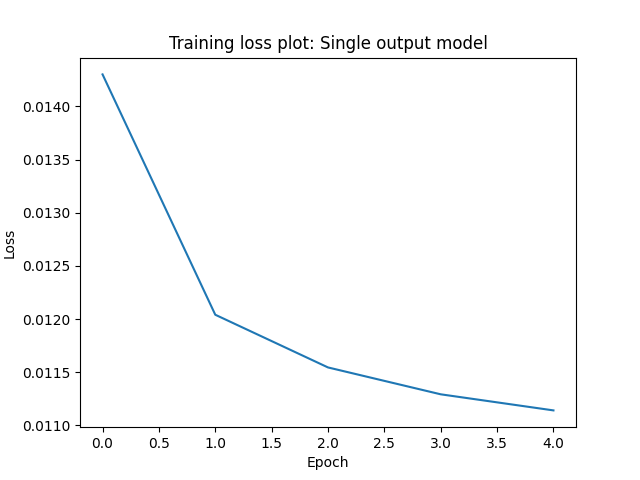
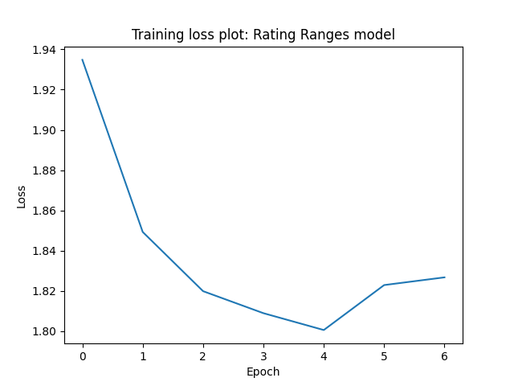
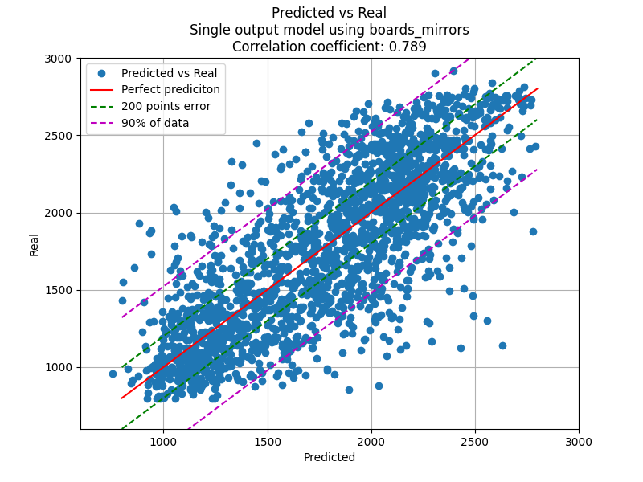
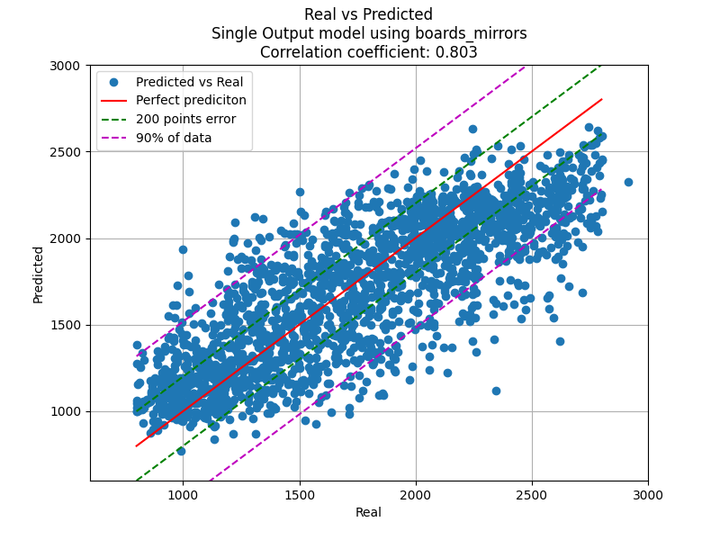

# Ai-Guess-the-Elo
An attempt at creating a neural network to guess a player's ELO rating based on their chess games/moves.

I had this idea in mind before chess.com released their version of an elo guessing ai but I postponed it long enough that they beat me to it. I was inpired by [Gothamchess' Guess the Elo series](https://www.youtube.com/watch?v=0baCL9wwJTA&list=PLBRObSmbZluRiGDWMKtOTJiLy3q0zIfd7).

All the effort on the project is condensed into a single file. You can run the `guess_the_elo.py` file with a pgn file as an argument. It will analyze the game, load the ai models and make a rating prediction for white and for black. For more info check [Usage instructions](#Usage).

## The Backbone
The project uses LSTM models from the [PyTorch](https://pytorch.org) libray to make the elo predictions. The models are fed games analyzed by stockfish and the [python-chess](https://python-chess.readthedocs.io/en/latest/#) library.

LSTM models were used, firstly as a learning experience, and secondly because their "memory" feature I thought closely resembles how a human would analyze a game. For more explanations behind the decisions made read the [Decisions Explained](models/Decisions_explained.md) file. 

For the training data, games from all elo ranges from the [open liches database June 2018](https://database.lichess.org/) were used after they were analyzed and modified accordingly. To speed up the proccess of uniformly selecting games of all elo ranges I used [pgn-extract](https://www.cs.kent.ac.uk/people/staff/djb/pgn-extract/).

## Results
The two models trained, as explained in the [Decisions Explained](models/Decisions_explained.md) file, were the single output elo prediction and the rating ranges precition. To summarize, the single output model predictis an elo rating while the rating ranges model predicts the propability of the elo being in one of 10 rating ranges.
```
<1000, 1000-1200, 1200-1400, 1400-1600, 1600-1800, 1800-2000, 2000-2200, 2200-2400, 2400-2600, >2600
```
Then takes the weighted average of those propabilities for the elo prediction.  
### Training
Both models were trained on 20000 games played on lichess.org in June 2018, 2000 games of each elo range were selected. From those, 15% was used for testing and from the remaining 85%, 10% was used for validation. They were trained for 5-10 epochs, enough to decrease the loss while also avoiding overfitting.
#### Single Output model
For the single output model Mean Squared Error was used as the loss function.

<p align="center">
  
</p>

#### Rating Ranges model
For the rating ranges model Cross Validation was used as the loss function. The problem is not exactly a classification problem because the weighted averages are used in the end for the elo prediction but it was the best I could find.


<p align="center">
  
</p>


It is important to note that a random classification model with 10 classes would have an average Cross Validation loss of `-ln(1/10) = 2.303`. That means the rating ranges model is better than a random one.


We can clearly see a downwards trend for both models that plateaus. We have reached a stagnation in traing while avoiding overfitting.


### Predictions


To rate the accuracy of the models they are tested on 3000 games (= 6000 predictions, 2 per game for white and black) and pitted againts two other trivial models. A random guessing one and one that always predicts a rating around the middle of the rating ladder (800 - 3000). We also give the models a leeway of 200 points on their guess. As the leeway increases so do the correct guesses but the precision is lowered.


#### Trivial models


The 2 trivial models seem to have around a 17-23% accuracy for a 200 point leeway and the average difference between the real value and the prediction is 500 points for the constant model and 700 for the random model. The constant models edges out the random one by a bit, both in accuracy and in average. Both of them are very bad at guessing the real elo of a player.


#### Single Output model


Now for the trained models, after training on 17000 games, the single output model achieved an accuracy of a little over 50% on 3000 test games, getting 3037 of the 6000 predictions within 200 points of the real value. That is an impressive score considering the complexity of chess. The mean difference between real and predicted elo is around 250 points.

<p align="center">
  
</p>

On this graph we can see 2000 of the 6000 predictions made. Plotting the real values with the predictions we can visualize the accuracy of the model. The closer to the red line (perfect macthing) a dot is, the better the prediction. Points that fall between the two green lines have a difference of less than 200 points. There we find 50% of the data. Additionally, 90% of the predictions are between the two purple lines, 500 points difference. This makes sense considering a bad game by a 1700 player could resemble a game of a 1200 player. Conversly, a good game by a 1200 could be mistaken for a 1700.

Taking variance in the level of play into account, I would say this model is pretty successful.

#### Rating Ranges model


The results for this model are similar. Above a 50% accuracy and less than 250 elo average difference with 90% of predictions within 500 points of the true values. Using it as purely a classification model, it guesses the correct range of the player around 30% of the time.

<p align="center">
  
</p>

Ploting real values vs predictions we can see a very similar graph. The points follow a line pretty closely meaning the model has understood the differences between a good and a not so good player and can make predictions accordingly. It's clear though that the model has some troubles predicting low elo games. For games <1000 elo, the model tends to overestimate the player. The tradeoff is a good modeling of the middle of the rating ladder.


These results can be found in their respective jupyter notebooks.


## Usage
To get elo predictions for your chess games clone this reporitory after you have installed the necessary python libraries
```
pip install torch tqdm python-chess
git clone https://github.com/HliasOuzounis/Ai-Guess-the-elo
```
or download the files from the release page (outdated: old models, less accurate), 


and run the `guess_the_elo.py` file with python
```
python guess_the_elo.py [--engine engine-dir] [-c] pgn_file
```

Because the training dataset was from lichess.org, the model has learned to predict lichess ratings. If your game is from chess.com pass the -c flag so the elo gets converted. On average chess.com ratings are 400 points lower than lichess.org.


Because the games need to be analyzed by an engine first, you need to have a chess engine installed, preferably [stockfish](https://stockfishchess.org/download/). Pass the path as the --engine argument when calling the file. On linux you can find the installed path of stockfish with `which stockfish`. On my arch-based distro that was `/usr/bin/stockfish` which I have used as the default.


Finally, pass the pgn file which contains the game as the last argument. It needs to be parsable by chess.pgn.read_game().
If you copy the pgn from the website's "share" feature onto a plain text file it should be good enough.

### Examples


Feeding the models [one of my games](https://lichess.org/BoxuoUjy/black#0)

```
python guess_the_elo.py my_game.pgn
```
<p align="center">
  
</p>
I get predictions:


- 1896 for myself (black) and 2091 for my opponent on the first model
- 1976 for myself and 2067 for my opponent on the second model

Considering I'm around 2000 rated on Lichess, those predictions are pretty good

For [other games](https://lichess.org/bNLqqjHP/black#0) the predictions don't line up in both models.
<p align="center"> 
  
</p>

- 2109 for white and 2212 for black on the first model
- 1819 for white and 1864 for black on the second model

We see that the second model underestimated me and my opponent while the first model overestimated us. It's hard to say which model is correct without an expert analyzing the game. I would assume though that sometimes it's the first, sometimes the second and sometimes none of them.

We should keep in mind that guessing a player's rating off of a single game is not a very good metric since players can have good or bad games. 

Additionally, a player can't show his full level if their opponent plays badly and hands him the win. That means a player's elo prediction is indirectly  affected by his opponent. (though the models judge a player solely on his moves, the positions that arise, which are determined by both players are also taken into account)

Also, those ratings depend a lot on the stockfish evaluation of each game which isn't totally consistent even when analyzing the same game. This variance is not very big though.

## Conclusions
Wow, chess is a very complex game, who would have thought! 

It seems the models were able to somewhat understand what it means to play at a higher level, but the training dataset was small considering the amount of ches games and the models not deep enough to perfectly grasp the level of a player based on their moves. It's also true that a players strength is difficult to measure based on just one game as the level of play has a lot of variance. Despite that, the accuracy that was achieved was satisfactory.

But it's safe to say that an experienced chess player/coach would propably make more accurate predictions than these models. Still, it was a fun project and a learning experience.