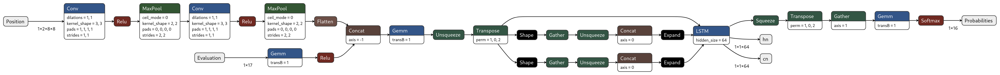
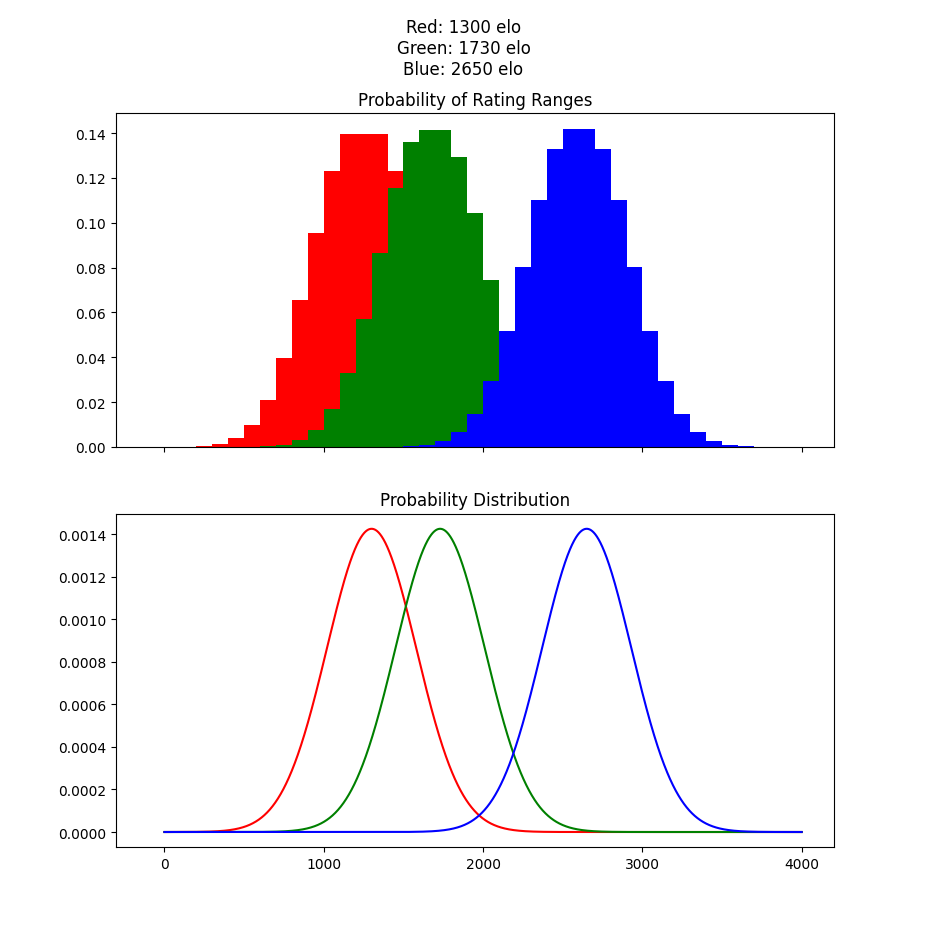

# Decisions Explained

## Why LSTM?

This is the major decision that everything else in the project builds on.

Since the model will be used to analyze chess games with an arbitrary amount of moves we need a model that can handle sequential inputs. Unfortunately, RNNs, the simplest recurrent networks suffer a lot from the vanishing (or exploding) gradient and as such have fall victim to the long-term dependency problem. Great moves or blunders in the earlier stages of the game would have little to no impact if the game drags on.

Then LSTM models are the logical continuation. They combat the long-term dependency problem with a gating mechanic. Depending on the new input, the model decides whether or not to forget the previous data.

This to me sounded a lot like how a human would approach guessing the elo of a chess game. Yes, maybe the player blundered in the beginning but made a comeback by playing a lot of good moves in a row. Then we could "forgive" the earlier mistake. Or the opposite. The player made a high level move but then immediately blundered and lost all his advantage. Then we could consider the good move a fluke and ignore it.

I thought of using transformers considering their popularity recently and the fact that they can use attention to better understand the relations between data or in this case chess moves. If trained well they could look at games not in terms of singular moves but by whole ideas and plans, looking at 5 or 6 moves at a time. Though they are computationally more expansive and need a fixed input size. But that's something to consider for a future project.

## What's the architecture of the network?

As explained above, the model utilizes the LSTM architecture to handle sequential inputs and make rating predictions using information from the current and past moves. Additionally it uses a cnn layer to analyze the chess positions and after the cnn output is flattened, it is combined with the stockfish analysis, that has also been parsed, and passed through a dense layer. The  outputs of the dense layer get passed through a softmax layer to get the probability of each range.

## What's the input to the models?

The model takes 2 inputs, a tensor with the board positions and a tensor with the evaluation from stockfish

The board positions are a (2, seq, 2, 8, 8) tensor.

- 2, for the batch dimension to parse white and black together
- seq, the number of moves in the game
- 2, channels for the cnn. One has the board representation and another is a mask with 1 or -1, depending on whose turn it is
- 8 x 8, is the size of the chess board

The evaluation tensor is a (2, seq, 17) tensor.

- 2, for the batch dimension
- seq, the number of moves in the game
- 17 some useful information about the position before and after the move. The top 10 move evaluations before the move was played and the win/draw/loss chance the engine gives, the evaluation after the move was played and the win/draw/lose chance after the move.

I was hoping that the models would be able to recognize the centipawn loss as the difference before and after the move was played and base their prediction on that. Also, by having the board representation they could also calculate a "complexity score" of the position. If the position was very complex, they would be more forgiving and not be too harsh on mistakes. If there was only 1 move and the player didn't play it he wouldn't be severely punished as if he played a losing move with 10 good options available.

That seemed to kinda work. I also tested the models without the board representation and they were noticeably worse.

For the board representation, the perspective flips on each players turn, meaning the player who's turn it is gets assigned the "white pieces" meaning positive values for their pieces and negative for their opponents. Also the stockfish evaluation was changed to reflect that by using the relative score, not the absolute. This approach seemed marginally better in my tests than the absolute values.

Another board representation idea was using bitboards which assign an 8x8 table to each piece type (separate for each color) and marking with a 1 if a piece of that type occupied the corresponding square. This approach had around the same accuracy for smaller sample sizes but I couldn't scale to more samples due to the larger vector sizes (my gpu ran out of memory).

## What's the output?

My first thought on the output of the model was a single value to predict the elo. This value would be normalized to 3000 because neural networks work better with values from 0-1. The output layer would be a softmax function to match this normalization.

To improve on this approach I examined how the ELO rating system works. In general, a player's strength isn't simply a fixed value but has some variance from game to game. So, by modeling the player's strength as a probability distribution over the whole elo rating range we can better model how they might play on a game to game basis. Some games they might play better than their elo, some worse, but it all averages out to their true elo rating.

With that in mind I split the elo ladder (0-4000) into rating ranges and for each player in the training dataset I calculated the probability of playing in each range by taking the integral of the probability density function in that range. The probability density function for each player is a normal distribution with mean their true elo rating and standard deviation 200 (more on that below).

  

The output of this new model would be a 39-vector with the probability of the rating of the player falling in each of the 39 rating ranges. To take these probabilities and calculate the mean, we find the middle of each range and take the weighted average of them by multiplying with the predicted probability. That's the mechanism behind the [rating-ranges model](lstm_train_rating_ranges.ipynb).

## Modeling the Elo as a normal distribution

Because a player's strength isn't fixed but has some variance from game to game, we model it as a normal distribution with mean the displayed elo of the player. To calculate the variance the distribution should have turn to how elo is calculated.

According to the Elo formula
${\displaystyle E_{\mathsf {A}}={\frac {1}{1+10^{(R_{\mathsf {B}}-R_{\mathsf {A}})/400}}}}$, where $R_A, R_B$ are the ratings of player A and B and $E_A$ is the expected score of player A

A difference of 100 points ($R_A = R_B + 100$) would mean an expected score for player A of 0.64, meaning he's expected to win 64% of the time. A difference of 200 points gives a 76% for A to win and a 400 points difference a 91% chance.

Considering the normal distributions of the players, player A has a distribution with mean = $R_A$ and standard deviation = σ and for player B, mean = $R_B$ and standard deviation = σ. The goal is to find σ.

What is the probability that A beats B with this approach? If X is a sample of player's A distribution and Y a sample of player's B, then we need to find the probability $P(X > Y)$.

But, $P( X > Y) = P(X - Y > 0)$. Because X and Y follow a normal distribution, their difference follows one as well. The mean of the new distribution is $μ = μ_X - μ_Y = R_A - R_B$ ad the standard deviation is $σ_Z = \sqrt{σ_X^2 + σ_Y^2} = \sqrt{2σ^2} = σ\sqrt{2}$

If we want a 64% that player A wins if he's 100 points higher rated then $P( X > Y ) = 0.64 => P(Z > 0) = 0.64$ where $Z = X-Y$.
We standardize, ${\displaystyle P( {\frac {Z - μ}{σ_Z} > - \frac {μ}{σ_Z}}) = P(\frac {Z - μ} {σ_Z} < \frac {μ} {σ_Z})}$ and substituting
$P(z < \frac {100} {σ\sqrt 2}) = 0.64$. Since z follows a standard normal distribution we can use a lookup table. The z-factor that corresponds to 0.64 probability is 0.361. That means that $\frac {100} {σ\sqrt 2} = 0.361 => σ = 195$

For a 200 points difference the z factor turns out to be 0.705 which in turn gives $σ = 199$

For 400 points difference the z factor is 1.34 and $σ = 211$

Because the Elo system wasn't strictly built around normal distributions, the calculated standard deviation is not the same for every case and differs by a bit. As a good approximation we'll take the standard deviation to be 200.
