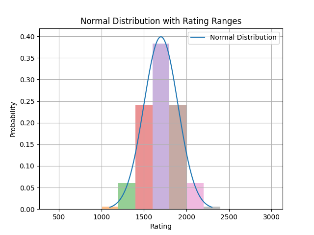

## Why LSTM?
This is the major decision that everything else in the project builds on.

Since the model will be used to analyze chess games with an arbitrary amount of moves we need a model that can handle sequential inputs. Unfortunately, RNNs, the simplest recurrent networks suffer a lot from the vanishing (or exploding) gradient and as such have fall victim to the long-term dependancy problem. Great moves or blunders in the earlier stages of the game would have little to no impact if the game drags on.

Then LSTM models are the logical continuation. They combat the long-term dependancy problem with a gating mechanic. Depending on the new input, the model decides whether or not to forget the previous data. 

This to me sounded a lot like how a human would approach guessing the elo of a chess game. Yes, maybe the player blundered in the beggining but made a comeback by playing a lot of good moves in a row. Then we could "forgive" the earlier mistake. Or the opposite. The player made a high level move but then immediatly blundered and lost all his advantage. Then we could consider the good move a fluke and ignore it.

There was a thought to use transformers considering their popularity recently and the fact that they can use attention to better understand the relations between data or in this case chess moves. If trained well they could look at games not in terms of singular moves but by whole ideas and plans, looking at 5 or 6 moves at a time. Though they are computationally more expansive and need a fixed input size. But that's something to consider for a future project.

## What's the input to the models?
The input to the modles is a 82 dimensional vector. It is composed a matrix representation of the current position and some info on the stockfish evaluation before and after the move.The board is an 8x8=64 matrix (flattened)with a value of 0 if the square is empty and a seperate value if it's occupied by a piece. 1 for white pawns, 3 for white knights, 3.5 for white bishops, 5 for white rooks, 9 for white queens and 20 for the white king. Black pieces have the opposite values. -1 for pawns, -3 for knights etc. They are also normalized between -1 and 1 by diving by 20 because neural networks respond better to smaller input values.

Additionaly it has a number to indicate whose turn it is 1 for white and -1 for black, the top 10 moves in the position, the winning/drawing/losing chance for the current player and the evaluation and winning/drawing/losing chance after the move was played. 

I was hoping that the models would be able to recognize the centipawn loss as the difference before and after the move was played and base their prediction on that. Also, by having the board representation they could also calculate a "complexity score" of the position. If the position was very complex, they would be more forgiving and not be too harsh on mistakes. If there was only 1 move and the player didn't play it he wouldn't be severly punished as if he played a losing move with 10 good options available.

That seemed to kinda work. I also tested the models without the board representation and they were noticably worse. 

More on the board representation, the perspective flips on each players turn, meaning the player who's turn it is gets assigned the "white piecies" meaning positive values for their pieces and negative for their opponents. Also the stockfish evaluation was changed to reflect that by using the relative score, not the absolute. This approach seemed marginally better in my tests than the absolute values.

Another board representation idea was using bitboards which assign an 8x8 table to each piece type (seperate for each color) and marking with a 1 if a piece of that type occupied the corresponding square. This approach had around the same accuracy for smaller sample sizes but I couldn't scale to more samples due to the larger vector sizes (my gpu ran out of memory).

## What's the output?
My first thought on the output of the model was a single value to predict the elo. This value was normalized to 3000 because neural networks work better with values from 0-1. The output layer is a softmax function to match this normalization. Additionally it smooths out very big or very small guesses so there aren't any crazy outliers. This is how the [single-output model](lstm_train_single_output.ipynb) works.

To improve on this approach I examined how the ELO rating system works. In general, a player's strength isn't simply a fixed value but has some variance from game to game. So, by modeling the player's strength as a probapility distribution over the whole elo rating range we can better model how they might play on a game to game basis. Some games they might play better than their elo, some worse, but it all averages out to their true elo rating. 

  

For example that's what a 1700 elo player's distribution would look like

With that in mind I picked 10 elo rating ranges [<1000, 1000-1200, 1200-1400, ..., 2400-2600, >2600] and for each player in the training dataset I calculated the probapility of playing in each range by taking the integral of the probability density function in that range. The probability density function for each player is a normal distribution with mean their true elo rating and standard deviation 200. 

The output of this new model would be a 10-vector with the probabilities of the player being in each of the 10 ranges. To take these probabilities and calculate the mean, we take a weighted average over the ranges. This has now turned into a classification problem (almost) where the model tries to predict the probability of the player's elo belonging to each range. That's the mechanism behind the [rating-ranges model](lstm_train_rating_ranges.ipynb).